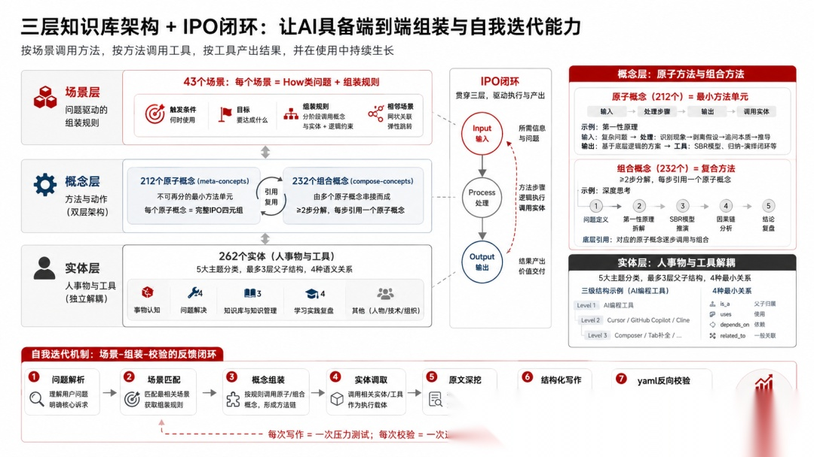
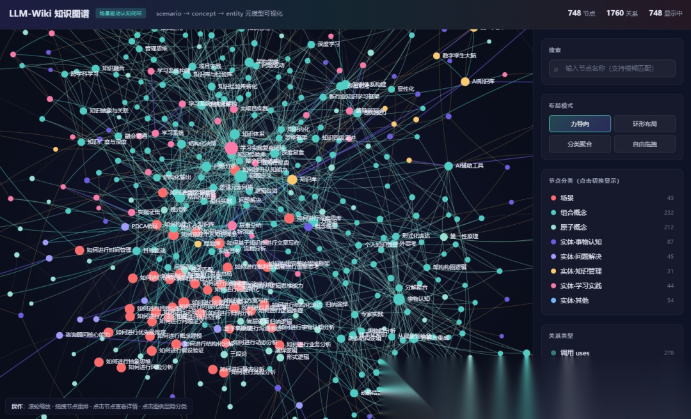
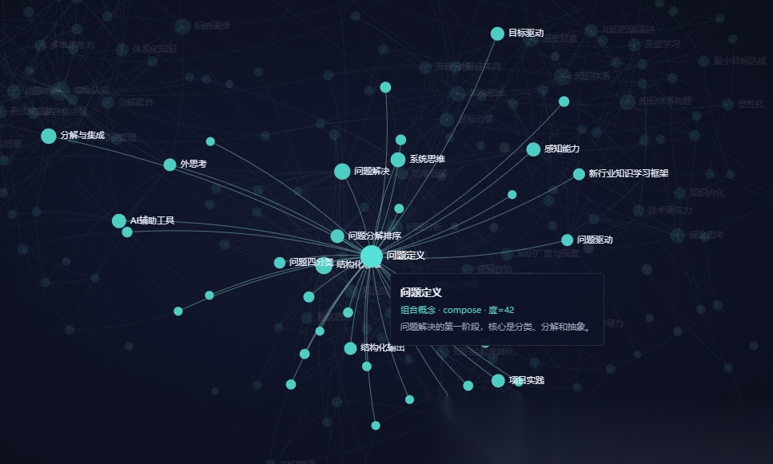
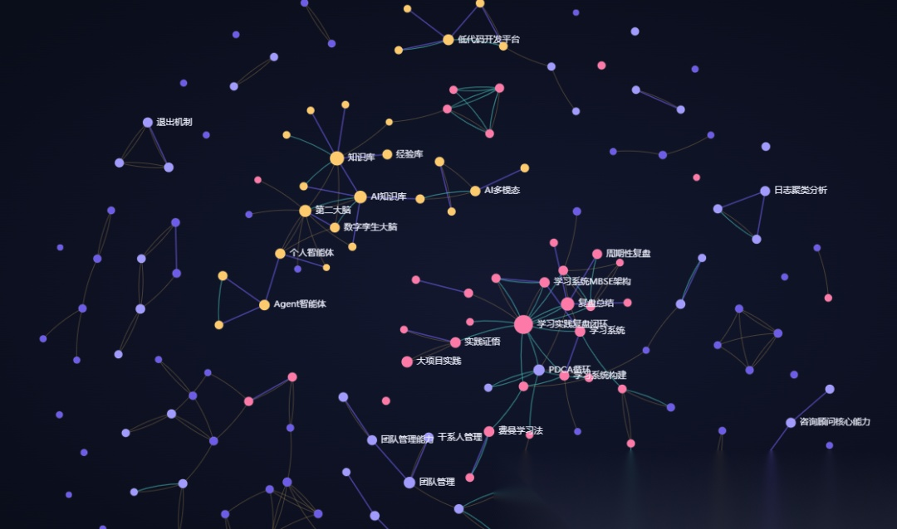
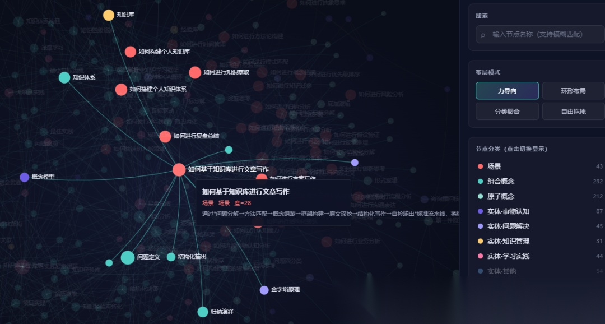
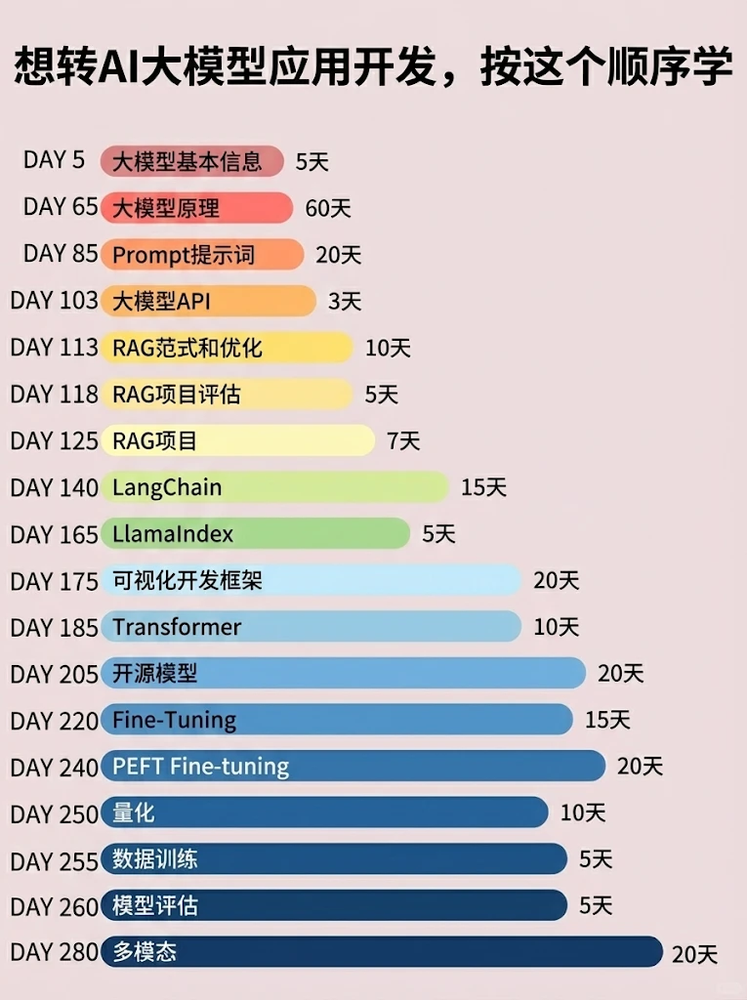

过去几年我陆陆续续写了几百篇个人思维与方法论方面的文章，并尝试参考 Karpathy 的 LLM-Wiki 思路，把这些文章萃取沉淀为一个结构化的个人知识库。最初的版本在"萃取"这件事上已经做到了相对充分——卡片、概念、方法论都各自独立成文。但当我真正把它交给 AI 去回答新问题、去写新文章的时候，问题就暴露出来了：**知识看起来是结构化的，但 AI 拿到它依然无法"组装"出一个完整解决方案**。

AI 能复述我说过的话，却无法面对一个新场景把我说过的话重新编排成一套针对性的方案。这让我意识到,知识萃取只是第一步,真正的难点是把知识转化为可被调用、可被组装、可自我迭代的认知操作系统。下面我把这一轮重构的完整思路和实践记录下来,既是阶段性复盘,也希望给同样在做个人知识体系的朋友一些参考。

 
第一版的 LLM-Wiki 我把它放在 `wiki/` 目录下,核心结构借鉴了 Karpathy 的思路,做了三件事:**为每一篇原始文章生成知识卡片**(cards 目录,147 篇)、**抽象出领域内的关键概念**(concepts 目录,715 个条目)、**整理面向不同问题的方法论**(method 目录,43 个方法)。这一版最大的价值在于把散落在 500 多篇原始文章中的隐性知识显性化了,我自己再回看的时候不再需要逐篇翻阅,而是可以从概念入口反向回溯到原文。

但当我尝试把这个知识库喂给 AI、让它基于这套素材回答新问题时,几个**根本性的局限**很快就浮现出来。

**第一,概念和实体严重混杂**。concepts 目录里既有"第一性原理"这种思维方法,也有"Cursor"“腾讯 ima 知识库"这种工具产品,还有"马斯克”“亚里士多德"这种人物。它们在本质上是不同的——方法是"用来做事的程式”,实体是"被用来做事的对象"——混在一起意味着 AI 无法清楚地区分哪些是可调用的"动词",哪些是可被引用的"名词"。

**第二,方法描述缺乏可执行规范**。我原来对每个方法的描述偏向"是什么",而非"怎么用"。一个完整的方法应该像一段流程:有输入、有处理步骤、有输出、有过程中使用的工具。但原版本里这些维度往往散落在叙述中,AI 无法机械地按图索骥地执行。

**第三,实体之间缺少分层结构**。"AI 编程工具"和"Cursor"在原版本里是平等的两个条目,而事实上前者是后者的父类。没有父子层级,AI 在做归类、检索和推理时就缺乏一条天然的语义路径。

**第四,也是最关键的——缺乏面向问题的组装机制**。method 目录虽然定义了"如何进行深度思考""如何快速切入新领域"这些场景化方法,但每个 method 内部仍然是叙述性文字,没有明确告诉 AI:**这个场景下,应该按怎样的顺序、调用哪些概念、用哪些工具,以及组装时的关键约束是什么**。

简单说,原版 wiki 是一座结构精良的"图书馆",但不是一个能自动响应需求的"工厂"。

 

意识到这些问题后,我做的第一个关键决策是:**不在原 wiki/ 目录上修改,而是新开一个 wiki1/ 目录重构**。原版的萃取成果作为事实依据保留,新版本只存"结构、关系、组装规则"这类元信息,通过 `source:` 字段反向指回原文。这样既不破坏原有积累,也保证了新版本足够轻量、便于 AI 加载和理解。

重构的总体思路可以浓缩为一句话:**从静态知识图谱,升级为场景驱动的认知闭环操作系统**。

我把整套知识库重新拆分为三层架构,中间贯穿一条 IPO 闭环。

**最上层是场景层**。这一层只关心"我要解决什么问题",每一个场景都对应一个真实的"How 类"问句——如何进行深度思考、如何快速切入新领域、如何复盘总结。场景层的核心字段不是知识本身,而是**组装规则**:面对这个场景,应该分几个阶段处理,每个阶段调用哪些底层概念和实体,以及组装时遵循什么逻辑约束。

**中间层是概念层**。概念是"方法",是动作。我把概念进一步拆分为两类:**原子概念**(meta-concepts)和**组合概念**(compose-concepts)。原子概念是不可再分的最小方法单元,比如归纳、演绎、抽象、MECE 法则;组合概念则是由若干原子概念串接而成的复合方法,比如深度思考、系统思考、批判性思考。这种拆分对应了软件工程里"原子函数"和"组合函数"的关系,是任何可复用系统的基础。

**最下层是实体层**。实体是"人事物",是名词。工具、技术、产品、框架、模型、人物、组织——所有方法在执行过程中会调用到的"对象",都收纳在这一层。实体允许多达三层的父子结构,以反映现实世界的归类关系。

而**贯穿这三层的 IPO 闭环**——输入(Input)、处理(Process)、输出(Output)——则是让整套系统从"描述性知识"变为"可执行规范"的关键。每个原子概念都被建模为一段流程:它需要什么输入、内部经过哪些步骤、产出什么结果、过程中用到了哪些实体作为工具。

这三层架构加上 IPO 闭环,让 AI 第一次具备了"按场景调用方法、按方法调用工具、按工具产出结果"的端到端组装能力。

 

概念层是这次重构里我投入精力最多的部分,因为它直接决定了 AI 组装时的"颗粒度"是否合适。

我最终在 wiki1/ 里沉淀了 **212 个原子概念**和 **232 个组合概念**。区分两者的判别标准非常明确:**原子概念必须有完整的 IPO 四元组,且不依赖其他概念组装**;组合概念则必须包含至少两步的 decomposition,每一步都引用一个 meta 概念。

以"深度思考"这个组合概念为例。它本身不是一个原子动作——你没办法直接"开始深度思考"。它实际上是由"问题定义→第一性原理拆解→SBR 模型推演→因果链分析→结论复盘"这样一连串原子动作组合而成。在 compose-concepts.yaml 里,我用 decomposition 字段把这些步骤串起来,每一步都明确指向一个 meta 概念,并写明"为什么在这一步需要它"。

而"第一性原理"作为一个原子概念,在 meta-concepts.yaml 里则被建模为一段完整的流程:**输入**是"待分析的复杂问题";**处理步骤**是"识别表面现象→剥离类比假设→追问底层不可再分要素→重新基于第一原理推导";**输出**是"基于底层逻辑的解决方案";过程中可能调用的**工具实体**包括 SBR 模型、归纳-演绎闭环等。

这种"原子-组合"双层设计带来的最大好处是**复用性**。同一个原子概念会被多个组合概念引用,同一个组合概念又会被多个场景引用。当我未来新增一个场景时,大概率只需要重新编排已有的概念,而不必从零定义新方法。这也意味着,知识库的边际扩展成本会随着积累越来越低——这是任何可持续生长的体系都必须具备的特性。

 

实体层的重构核心是做**减法**——把原本混在 concepts 里的人事物全部抽离出来,独立成 5 个 yaml 文件。分类的依据是我历史文章本身的四大主题:**事物认知**(87 个实体)、**问题解决**(44 个)、**知识库与知识管理**(33 个)、**学习实践复盘**(44 个),以及一个**其他**(54 个)兜底人物、底层技术和组织。

实体内部支持最多三层的父子结构。比如"AI 编程工具"是一个 level 1 实体,“Cursor”“GitHub Copilot”"Cline"是它的 level 2 子实体,Cursor 下还可以挂载具体的 Composer、Tab 补全等 level 3 子实体。三层是我刻意设计的上限——超过三层意味着分类粒度过细,会让 AI 在导航时产生歧义。

实体之间的语义关系我刻意压缩到**4 种最小集**:`is_a`(父子归属)、`uses`(使用)、`depends_on`(依赖)、`related_to`(一般关联)。最小集的好处是判定逻辑足够清晰——AI 不需要在"组合"“涉及”“涵盖”"影响"几十种关系里纠结,只需要按"是否归属→是否调用→是否依赖→兜底关联"四步判定即可。事实证明,这 4 种关系已经能覆盖绝大多数语义场景,而清晰可枚举的关系类型本身就是 AI 友好性的核心。

实体层独立出来的最大价值,是让**方法和工具实现了解耦**。当未来出现新的 AI 编程工具——比如 Cursor 的某个竞品——我只需要在 entity-knowledge.yaml 里挂一个新实体节点,所有调用"AI 编程"这一概念的场景都能自动受益,而不需要去逐一修改概念定义。这就是软件工程里"中台"思想在知识体系上的复刻。

 

场景层是这次重构里最有意思也最具突破性的设计。

传统的知识库——无论是 Notion、Obsidian 还是各种 AI 知识库产品——本质上都是**以知识为中心**:用户输入问题,系统检索最相关的几条知识返回。这种模式的天花板很低,因为它假设"知识本身就是答案",而事实上**真正有价值的答案往往是若干知识的特定组合**。

wiki1/ 的场景层把这个假设彻底翻转。我现在沉淀了 **43 个场景**,每一个场景都对应一个真实的工作问题。每个场景的 yaml 条目都包含四个核心字段:**trigger**(何时触发这个场景)、**goal**(要达成的目标)、**composition**(分阶段的组装规则)、**related_scenarios**(相邻场景)。

其中 composition 是最关键的字段。以"如何基于知识库进行文章写作"这个场景为例,它的 composition 被拆分成七个 phase:**输入解析→Method 匹配→问题分解→框架冻结→原文深挖→结构化写作→自检输出**。每个 phase 下都明确写出:这个阶段使用哪些概念(concept://)、哪些实体(entity://),以及这一阶段的关键组装规则(rule)是什么。

这种设计的精妙之处在于,**它把"专家经验"显性化为可执行的流程**。AI 不再需要"理解我"才能写出像我的文章,它只需要严格按照场景的组装规则去调用底层概念和实体,产出的结果就会天然符合我的方法论框架。这是一个从"理解驱动"到"组装驱动"的范式转变——前者依赖大模型本身的智能,后者只依赖结构化规则的精度,后者更稳定、更可控、更可迭代。

更进一步,场景之间通过 `related_scenarios` 形成网状关联。当主场景未能完全覆盖用户问题时,AI 可以沿着相邻场景跳转检索,或者把多个相近场景的 composition 组合使用。这让整个场景层具备了**类生物组织一样的弹性**。

 
如果 wiki1/ 只是一个静态的元模型,那它仍然只是一座更精致的图书馆。让它成为"操作系统"的最后一块拼图,是**自我迭代机制**。

我为这套系统配套写了一份 profile.md 作为 AI 的操作规程,定义了**7 步标准写作流水线**:问题解析→场景匹配→概念组装→实体调取→原文深挖→结构化写作→**yaml 反向校验**。前 6 步都是常规的检索组装动作,第 7 步才是这套系统真正的灵魂。

每次 AI 完成一篇文章后,必须强制执行一次反向检视:**这次写作过程中,有没有出现 yaml 里找不到的新场景?有没有用到 yaml 里没定义的新概念?有没有提及 yaml 里没有的新实体?发现了哪些新的关系应该补充进现有条目?有没有死链——即引用了一个根本不存在的 id**?所有发现都以 yaml 条目骨架的形式返回给我,由我决定是否合入主库。

这个机制让 wiki1/ 第一次具备了**在使用中生长的能力**。每一次回答新问题,都是对知识库的一次压力测试;每一次写作完成,都可能给知识库带来新的场景、概念或实体。一段时间之后,知识库就会从"我手动定义的样子",慢慢演化成"被真实使用场景塑造的样子"——而后者才是真正贴近实际需求的知识体系。

这背后的哲学其实并不复杂:**任何可持续生长的系统,都必须包含一个反馈闭环**。学习-实践-复盘是个人成长的闭环,PDCA 是组织管理的闭环,而场景-组装-校验则是知识库自身演化的闭环。

 
这一轮重构做完之后,我有几个更深的感受想分享出来,既是对自己的提醒,也希望对正在做个人知识管理的朋友有所启发。

**第一,知识管理的终点不是知识图谱,而是认知组装能力**。绝大多数人——包括过去的我——花了大量时间在"输入"和"整理"上,但真正决定知识价值的是"调用"和"组装"。如果你的知识库无法在面对一个新问题时快速给出针对性的组装方案,那它的价值就停留在"资料库"层级,远没有触达"经验库"和"模式库"。

**第二,结构化的本质是"颗粒度选择"**。把方法拆得太粗,AI 没法复用;拆得太细,又会陷入细节地狱。原子-组合的双层设计、实体的三层结构、关系的最小集——这些设计选择背后都是同一个判断:**在足够精细以保证可执行性、和足够抽象以保证可复用性之间,找到那个最优平衡点**。这个平衡点不是一次性找到的,而是在反复使用中校准的。

**第三,AI 时代的个人核心竞争力,正在从"知识掌握"转向"知识结构化能力"**。当 AI 可以快速获取任何公开知识时,你能给 AI 提供怎样的"私有结构化输入"就成了差异化的关键。我把这套 wiki1/ 喂给 AI,本质上是把"我多年的方法论积累"变成了一个 AI 可调用的扩展插件。这才是个体在 AI 时代真正能构建的护城河——**不是和 AI 比谁知道得多,而是把自己的隐性经验显性化、结构化、可调用化,让 AI 成为自己思维方式的放大器**。

**第四,真正的知识体系必须是活的**。它必须能感知到新问题、能识别自己的盲区、能在反馈中生长。一个只增不减、只存不用的知识库,本质上和一个被遗忘的硬盘没有区别。

 
回过头看,从 raw 目录的原始文章,到 wiki/ 目录的知识萃取,再到 wiki1/ 目录的认知闭环——这三层迭代,本质上对应的正是"资料库 → 知识库 → 模式库"的演进路径。每一次迭代,知识的可用性都向前推进了一大步:从"我能看"到"我能查",再到"AI 能调用、能组装、能自我迭代"。

这套系统目前还远谈不上完美。43 个场景显然没有覆盖所有问题域,212 个原子概念也一定还存在颗粒度不一致的地方,实体之间的关系网络也还会随着使用不断密化。但我并不焦虑这些不完美——正因为预留了 yaml 反向校验这条自我迭代通道,**这套系统不需要"被完成",它只需要被使用**。每一次使用,都是它的一次成长。

我把这一轮重构记录下来,不是为了展示一个"最终答案",而是想分享一种**做事方式**:面对再复杂的体系,只要找到正确的元模型、定义清晰的接口、保留自我迭代的反馈闭环,它就会自己长大。这恰恰也是我想表达的核心信念——**真正强大的不是知识本身,而是承载知识的那套结构**。

 
🤔2026年AI风口已来！各行各业的AI渗透肉眼可见，超多公司要么转型做AI相关产品，要么高薪挖AI技术人才，机遇直接摆在眼前！

有往AI方向发展，或者本身有后端编程基础的朋友，直接冲AI大模型应用开发转岗超合适！

就算暂时不打算转岗，了解大模型、RAG、Prompt、Agent这些热门概念，能上手做简单项目，也绝对是求职加分王🔋

**📝给大家整理了超全最新的AI大模型应用开发学习清单和资料，手把手帮你快速入门！👇👇**

**学习路线:**

✅大模型基础认知—大模型核心原理、发展历程、主流模型（GPT、文心一言等）特点解析

 ✅核心技术模块—RAG检索增强生成、Prompt工程实战、Agent智能体开发逻辑

 ✅开发基础能力—Python进阶、API接口调用、大模型开发框架（LangChain等）实操

 ✅应用场景开发—智能问答系统、企业知识库、AIGC内容生成工具、行业定制化大模型应用

 ✅项目落地流程—需求拆解、技术选型、模型调优、测试上线、运维迭代

 ✅面试求职冲刺—岗位JD解析、简历AI项目包装、高频面试题汇总、模拟面经

以上6大模块，看似清晰好上手，实则每个部分都有扎实的核心内容需要吃透！

我把大模型的学习全流程已经整理📚好了！抓住AI时代风口，轻松解锁职业新可能，希望大家都能把握机遇，实现薪资/职业跃迁～

`保证100%免费`】

 
